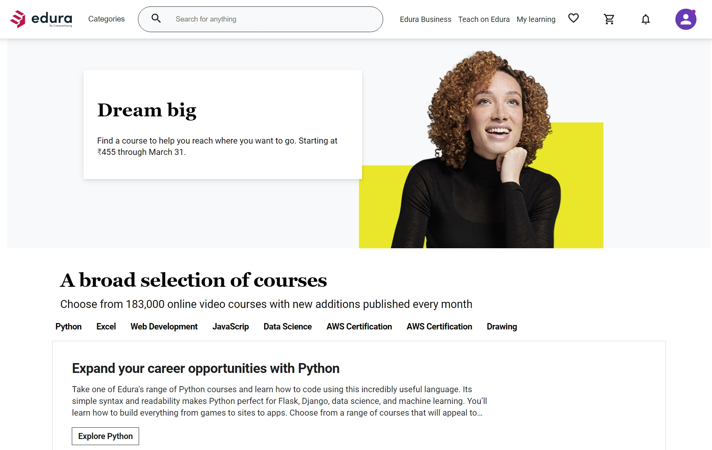
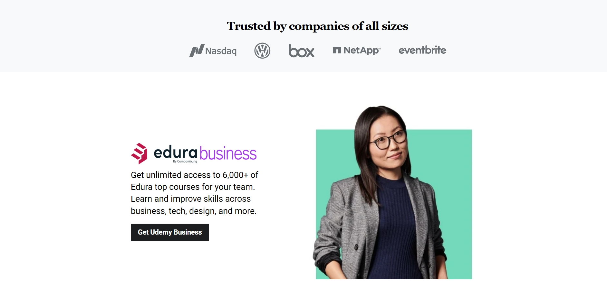
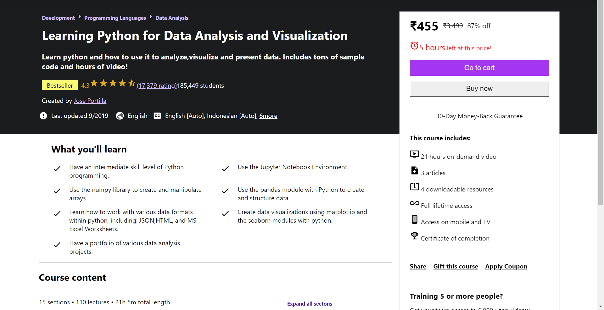

# Getting Started with Create React App

This project was bootstrapped with [Create React App](https://github.com/facebook/create-react-app).

## Available Scripts

In the project directory, you can run:
## There is Two Directory 
1. udemy-clone/server that contains backend code 
2. udemy-clone/client it contains Frontend

### Landing Page

## Popper Card

### Product Page

# Cart Page

### Auth Page

](https://user-images.githubusercontent.com/95868808/164770957-fcb7151a-fb51-4f2f-bbcf-051e2a6edb36.png)

